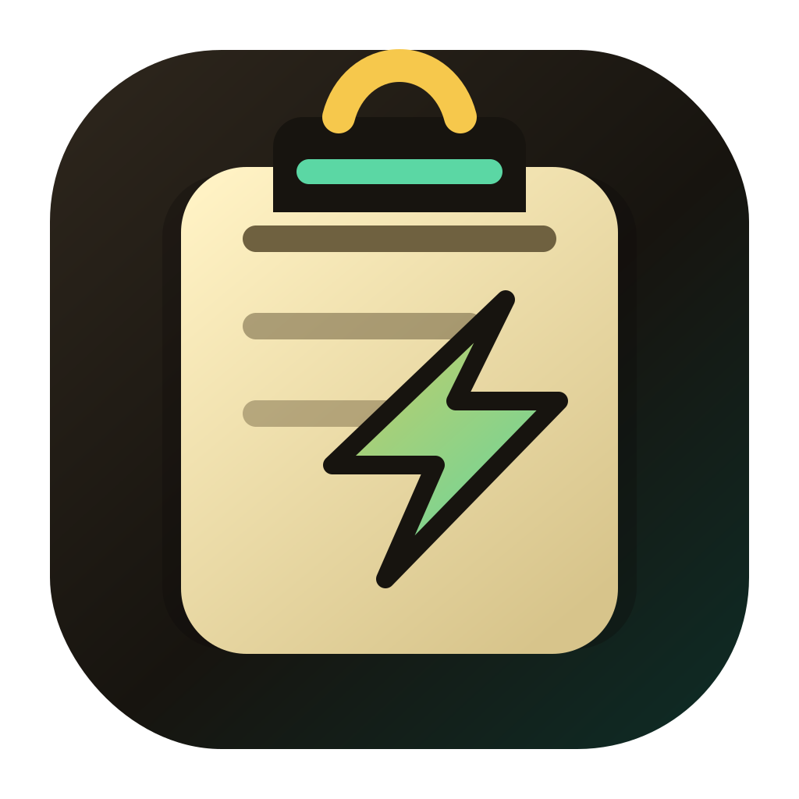
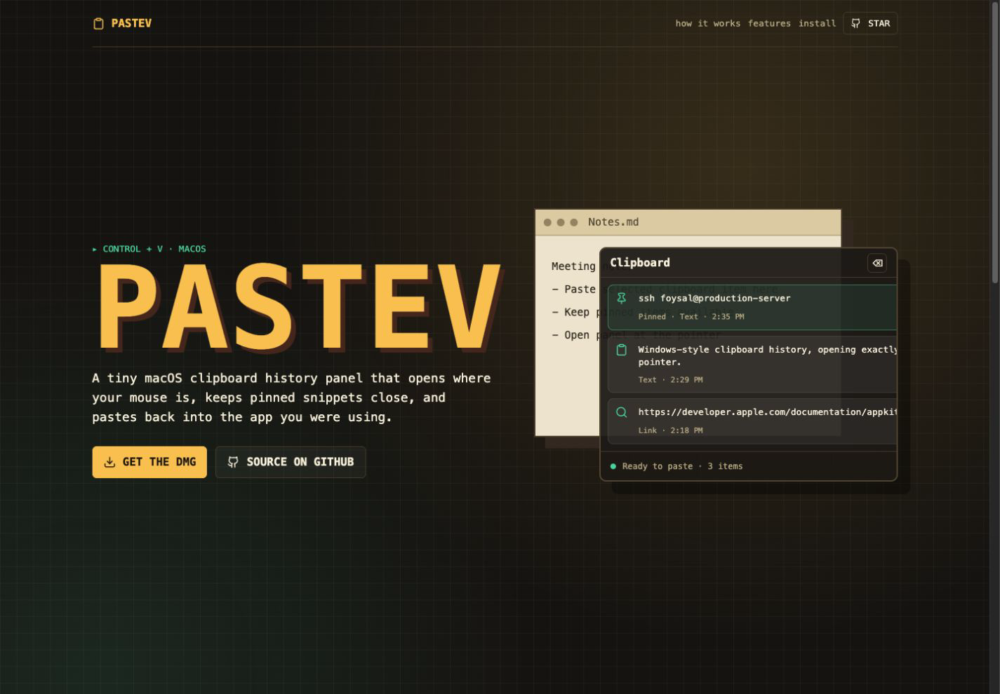
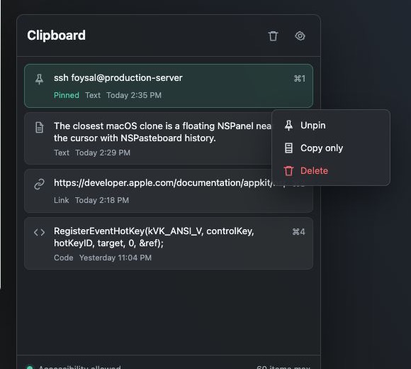

<p align="center">
  
</p>

# PasteV

Windows-style clipboard history for macOS.

PasteV is a small menu bar utility that opens a compact clipboard history panel beside your mouse pointer with `Control + V`. Pick an item to paste it back into the app you were using, or right-click to pin, copy only, or delete.



## Download

Download the latest DMG from:

https://github.com/ahfoysal/PasteV/releases/latest

Live landing page:

https://pastev.vercel.app

## Preview



## Features

- Global `Control + V` clipboard history shortcut
- Opens at the current mouse position
- Compact panel height for a short history
- Scrollable panel when history grows
- Right-click menu with `Pin`, `Unpin`, `Copy only`, and `Delete`
- Pinned items stay at the top
- Clear unpinned history
- Menu bar utility with no Dock icon
- Local clipboard storage using macOS user defaults

## Install

1. Download `PasteV-0.1.6.dmg` from the latest release.
2. Open the DMG.
3. Drag `PasteV.app` into `Applications`.
4. Open PasteV.
5. Enable PasteV in **System Settings > Privacy & Security > Accessibility**.
6. Quit and reopen PasteV once after granting permission.

Accessibility permission is required only for the automatic paste step. Without it, PasteV can still copy the selected history item back to the clipboard.

If macOS refuses Accessibility permission, PasteV still remains usable: selecting a history item copies it and closes the panel, then you can press `Command + V` in the target app. Use the menu bar item **Fix Accessibility Permission** to open the correct Settings pane for auto-paste.

## Build Locally

```bash
cd /Users/foysal/Projects/PasteV
./Scripts/build-app.sh
```

The app is installed locally at:

```text
/Users/foysal/Applications/PasteV.app
```

## Create DMG

```bash
cd /Users/foysal/Projects/PasteV
./Scripts/create-dmg.sh
```

The DMG is created at:

```text
Releases/PasteV-0.1.6.dmg
```

## Landing Page

The Vercel landing page source lives in `Website/`.

Live site:

https://pastev.vercel.app

```bash
cd Website
npm install
npm run build
vercel login
vercel --prod
```

## macOS Notes

macOS does not expose Apple’s built-in clipboard history to third-party apps, so PasteV starts building history from the moment it is running.

During development, rebuilding the app can invalidate Accessibility permission because macOS tracks the signed app identity. For normal use, install the release DMG into `Applications` and grant permission to that installed app.

## Tech

- Native AppKit Objective-C app
- Carbon global hotkey registration
- `NSPasteboard` clipboard monitoring
- `NSPanel` floating history panel
- `CGEvent` paste automation
- Vite + React landing page
